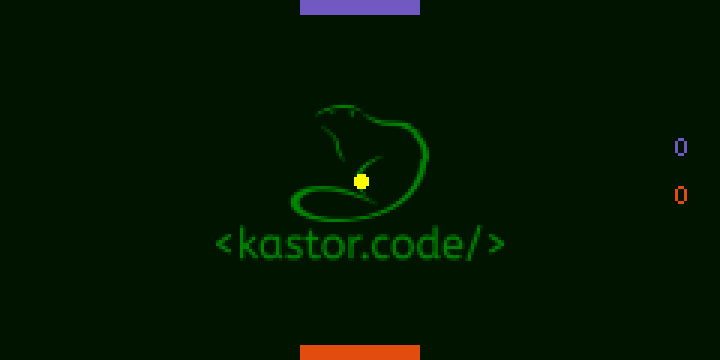

## Pong

> 👷 Developed by Matheus Ramalho de Oliveira.  
🔨 Systems Analyst, Full-Stack Developer.  
🏡 Goiânia, Goiás, Brasil.  
✉️ kastorcode@gmail.com  
👍 [instagram.com/kastorcode](https://www.instagram.com/kastorcode)

---

    Ping Pong game developed in Java.

---

### Screenshots

    

    

---

### 🏓 Installation and execution

1. Make a clone of this repository;
2. Import the project into a `Java IDE`, such as [Eclipse](https://www.eclipse.org/ide) or [NetBeans](https://netbeans.apache.org);
3. Press `Ctrl + F11` to start the game;
4. `Space`: pause and resume;
5. `Left and right arrows`: controls your rectangle.
